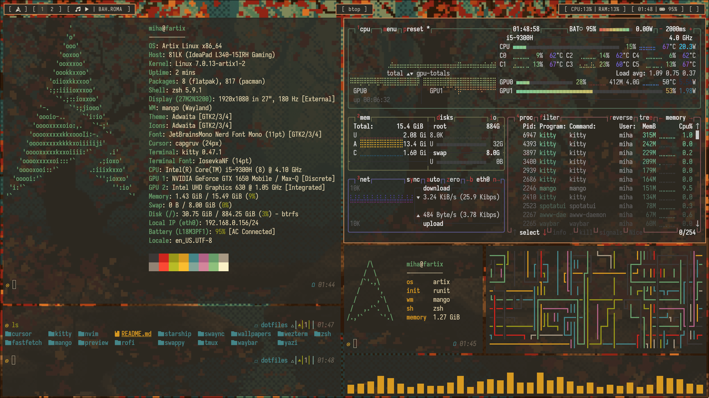

# dotfiles

**This small repo pretty much contains some of my dotfiles, cursors and wallpapers (all stowable), so feel free to use it ;D**

---

## Preview



---

## Installation

**Firstly, install GNU stow from [here](https://www.gnu.org/software/stow/) or by using your favorite package manager**

### Then, clone repo by running

```bash
git clone https://github.com/Miha77777ua/dotfiles.git
```

### Then, cd into cloned repo

```bash
cd dotfiles
```

### And run _stow_ for every package

```bash
stow <name of package, like nvim>
```

### And you are done
