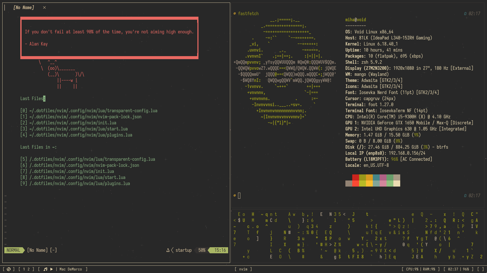
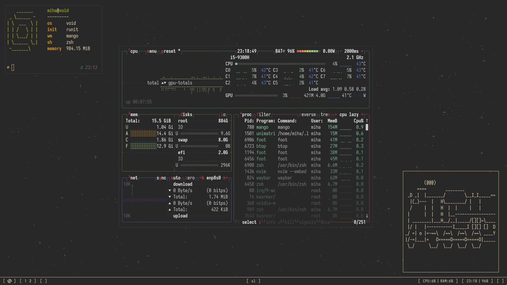
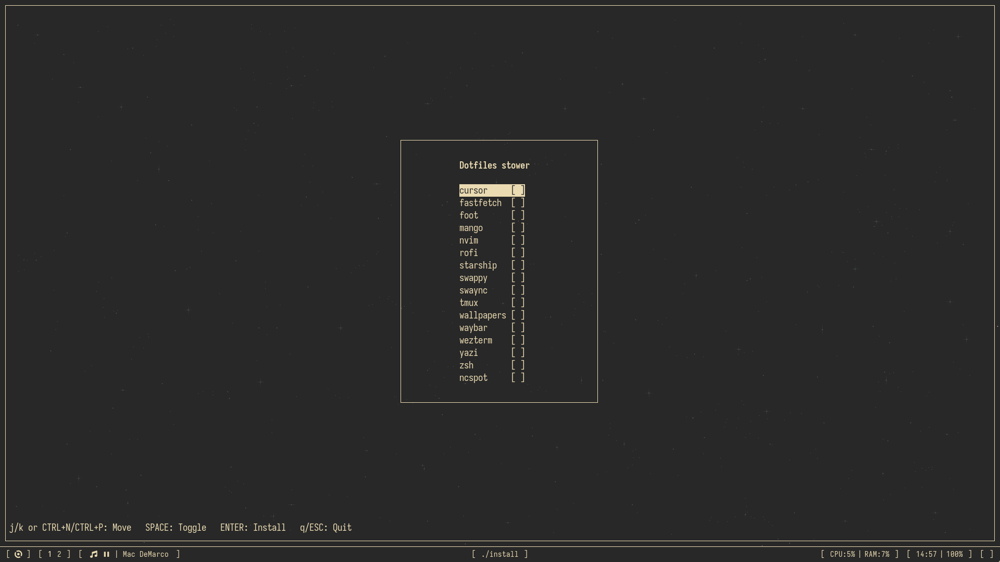

# dotfiles✨

**This a small repo which contains my dotfiles, cursors and wallpapers (all stowable) and also a simple TUI installer for them**

---

## Preview





---

## Installation

**Firstly, install <u>GNU stow</u> from [here](https://www.gnu.org/software/stow/) or by using your favorite package manager**

**Then, ensure you have `git` and clone repo by running**

```bash
git clone https://github.com/Miha77777ua/dotfiles.git
```

**Then, cd into cloned repo**

```bash
cd dotfiles
```

**There are two methods: with <u>TUI installer</u> or <u>manually</u>**

### 1. TUI installer

**`make` is required**

**Simply run**

```bash
./install
```

**It's a shell script, which will compile simple ncurses program, written in c, which is located in `installer` subdir**

### 2. Manual installation

**Run `stow` for every package (use `--no-folding` flag for safety, if you are unsure that .local or .config folders exist)**

```bash
stow --no-folding <name of the package, like nvim>
```
