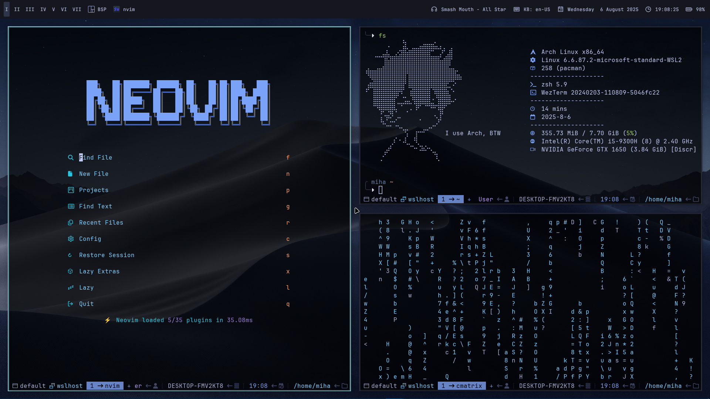

# dotfiles

**This small repo contains my dotfiles for a WSL setup**
> [!NOTE]
> **This repo contains config only for cli tools like neovim, fastfetch etc** 

# Preview (screen made from Windows with [komorebi TWM](https://github.com/LGUG2Z/komorebi))

